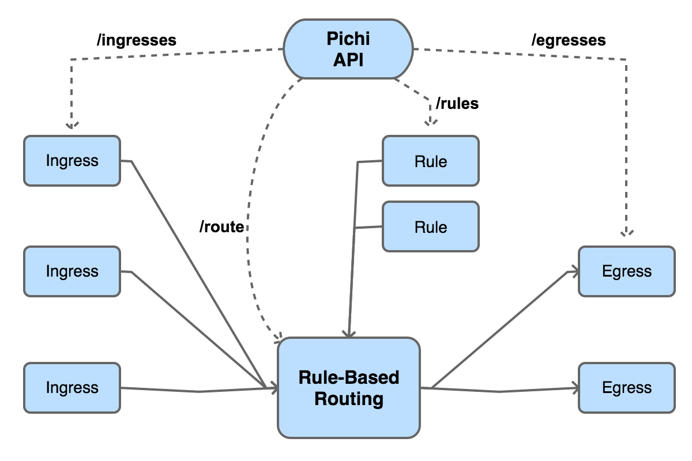
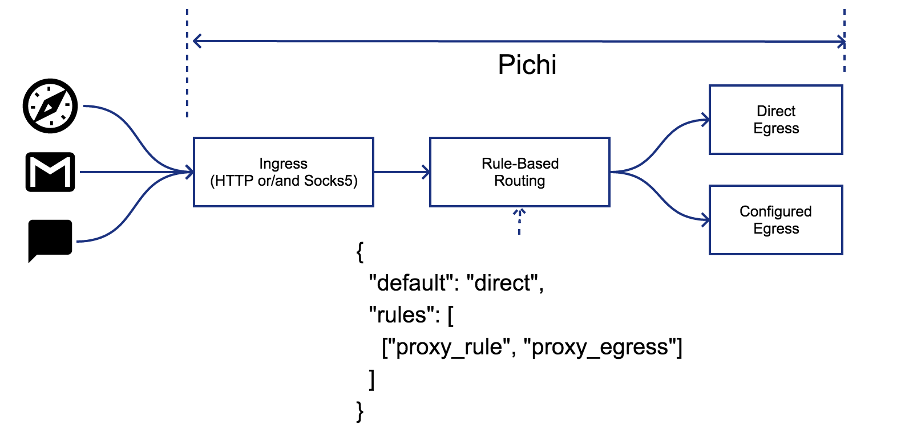
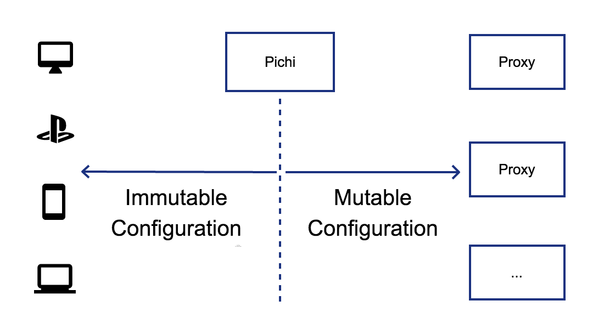

# Pichi 

Pichi is an application layer proxy, which can be fully controlled via RESTful APIs.

## Build Status

| OS | macOS 10.13 | Alpine 3.9 | Windows 10 | iOS 12.1 | Android 9 |
|:----------------:|:--------------------------------------------------------------------------------------------------------------------------------------------------:|:--------------------------------------------------------------------------------------------------------------------------------------------------:|:---------------------------------------------------------------------------------------------------------------------------------------------------------------------:|:--------------------------------------------------------------------------------------------------------------------------------------------------:|:--------------------------------------------------------------------------------------------------------------------------------------------------:|
| **Toolchain** | Xcode 10.1 | GCC 8.x | VC++2017 | Xcode 10.1 | NDK r18b |
| **Architecture** | x86_64 | x86_64 | x86_64 | arm64/arm64e | arm64 |
| **Status** | [](https://travis-ci.org/pichi-router/pichi) | [](https://travis-ci.org/pichi-router/pichi) | [](https://ci.appveyor.com/project/pichi-router/pichi) | [](https://travis-ci.org/pichi-router/pichi) | [](https://travis-ci.org/pichi-router/pichi) |

## Overview

Pichi is designed

1. **to support common proxy protocols**: HTTP(S)/Socks5(s)/Shadowsocks;
1. **to dynamically and flexibly control the proxy route**: just use RESTful APIs;
1. **developer oriented**: NO GUI, but can be easily integrated into other GUIs;
1. **for personal usage**: performance is important, but not the first priority;
1. **for multiple platforms**: at least Windows, POSIX-compatible, Android and iOS.



### Motivation

Proxy is widely applied to traverse through the firewall, hide or change the original address, expose internal service port, etc. But if we iterate some famous proxy tools, it's easily recognized that each of them has at least one of these cons list below:

* Not support all of HTTP, Socks5, Shadowsocks
* Not support multiple ingresses or egresses
* No rule-based routing

As a result, the motivation of pichi is to provide a tool, which can

1. support sufficient proxy protocols,
1. be easily integrated with GUIs/APPs/scripts, which might have their own rule database,
1. control rule-based routing at runtime.

### Use cases

#### Alternative to PAC

If an individual user is using a proxy, it's very common that the network traffic is probably split into 2 pieces of flow, one going through the proxy and another going directly.
[PAC](https://en.wikipedia.org/wiki/Proxy_auto-config) is a good choice if web browsing is heavily used. But unfortunately, not all applications support PAC, such as most of [MUA](https://en.wikipedia.org/wiki/Email_client), [IM](https://en.wikipedia.org/wiki/Instant_messaging), and so on.

Pichi is an alternative choice for this situation. It separates routing rules from every application.



#### Unified proxy configuration

If the configuration for remote proxies is volatile, such as changing IP/Port periodically, it's a nightmare that lots of clients are using it.
Pichi can centralize the varies, rather than editing the configuration client by client.



### Supported protocols

#### Ingress protocols

* HTTP Proxy: defined by [RFC 2068](https://www.ietf.org/rfc/rfc2068.txt)
* HTTP Tunnel: defined by [RFC 2616](https://www.ietf.org/rfc/rfc2817.txt)
* SOCKS5: defined by [RFC 1928](https://www.ietf.org/rfc/rfc1928.txt)
* Shadowsocks: defined by [shadowsocks.org](https://shadowsocks.org/en/spec/Protocol.html)

#### Egress protocols

* HTTP Proxy: defined by [RFC 2068](https://www.ietf.org/rfc/rfc2068.txt)
* HTTP Tunnel: defined by [RFC 2616](https://www.ietf.org/rfc/rfc2817.txt)
* SOCKS5: defined by [RFC 1928](https://www.ietf.org/rfc/rfc1928.txt)
* Shadowsocks: defined by [shadowsocks.org](https://shadowsocks.org/en/spec/Protocol.html)
* Direct: connecting to destination directly
* Reject: rejecting request immediately or after a fixed/random delay

**NOTE:** HTTP egress would like to try [HTTP CONNECT](https://www.ietf.org/rfc/rfc2817.txt) first. HTTP proxy will be chosen if the previous handshake is failed.

## Get started

### Installation

#### Linux

Please use [Docker](https://www.docker.com):

```
$ docker pull pichi/pichi:1.2.0
$ docker run --rm pichi/pichi:1.2.0 pichi <options>
```

#### macOS

Please use [Homebrew](https://brew.sh):

```
$ export PICHI_OPTS="options you like"
$ brew tap pichi-router/pichi
$ brew install pichi
$ pichi <options>
```

#### Windows, FreeBSD or others

Please refer to **Build** section.

### Run

```
$ pichi -h
Allow options:
  -h [ --help ]              produce help message
  -l [ --listen ] arg (=::1) API server address
  -p [ --port ] arg          API server port
  -g [ --geo ] arg           GEO file
  --json arg                 Initail configration(JSON format)
  -d [ --daemon ]            daemonize
  -u [ --user ] arg          run as user
  --group arg                run as group
```

`--port` and `--geo` are mandatory. `--json` option can take a JSON file as an Initial configuration to specify ingresses/egresses/rules/route. The initial configuration format looks like:

```
{
  "ingresses": {
    "ingress-0": {/* ingress configuration */},
    "ingress-1": {/* ingress configuration */}
  },
  "egresses": {
    "egress-0": {/* egress configuration */},
    "egress-1": {/* egress configuration */}
  },
  "rules": {
    "rule-0": {/* rule configuration */},
    "rule-1": {/* rule configuration */}
  },
  "route": {/* route configuration */}
}
```

Please refer to **Using Pichi API** section for the details of configurations of ingress/egress/rule/route.

Furthermore, Pichi server reloads JSON configuration on `SIGHUP` received if OS supports.

## Using Pichi API

### Resources

* **Ingress**: defines an incoming network adapter, containing protocol type, listening address/port, and protocol-specific configurations.
* **Egress**: defines an outgoing network adapter, containing protocol type, next hop address/port, and protocol-specific configurations.
* **Rule**: contains a group of conditions, such as IP ranges, domain regular expressions, the countries of the destination IP, and so on, that the incoming connection matching ANY conditions means the one matching this rule.
* **Route**: indicates a priority ordered sequence of \[rule, egress\] pairs, and a default egress which would be forwarded to if none of the rules matched.

### API Specification

[Pichi API](https://app.swaggerhub.com/apis/pichi-router/pichi-api/1.2)

### Examples

#### Proxy like ss-local(shadowsocks-libev)

```
$ curl -i -X PUT -d '{"type":"socks5","bind":"127.0.0.1","port":1080}' http://pichi-router:port/ingresses/socks5
HTTP/1.1 204 No Content

$ curl -i -X PUT -d '{"type":"ss","host":"my-ss-server","port":8388,"method":"rc4-md5","password":"my-password"}' http://pichi-router:port/egresses/shadowsocks
HTTP/1.1 204 No Content

$ curl -i -X PUT -d '{"default":"shadowsocks"}' http://pichi-router:port/route
HTTP/1.1 204 No Content

```

#### HTTP proxy except intranet

```
$ curl -i -X PUT -d '{"type":"http","bind":"::","port":8080}' http://pichi-router:port/ingresses/http
HTTP/1.1 204 No Content

$ curl -i -X PUT -d '{"type":"http","host":"http-proxy","port":8080}' http://pichi-router:port/egresses/http
HTTP/1.1 204 No Content

$ curl -i -X PUT -d '{"range":["::1/128","127.0.0.1/32", "10.0.0.0/8", "172.16.0.0/12", "192.168.0.0/16", "fc00::/7"],"domain":["local"],"pattern":["^localhost$"]}' http://pichi-router:port/rules/intranet
HTTP/1.1 204 No Content

$ curl -i -X PUT -d '{"default":"http","rules":[["intranet","direct"]]}' http://pichi-router:port/route
HTTP/1.1 204 No Content

```

#### 100 shadowsocks servers

```
$ for((i=20000;i<20100;++i)); do \
>   curl -X PUT \
>   -d "{\"type\":\"ss\",\"bind\":\"::\",\"port\":$i,\"method\":\"rc4-md5\",\"password\":\"pw-$i\"}" \
>   "http://pichi-router:port/ingresses/$i"; \
> done

```

#### dark web

```
$ curl -i -X PUT -d '{"type":"socks5","host":"localhost","port":9050}' http://pichi-router:port/egresses/tor
HTTP/1.1 204 No Content

$ curl -i -X PUT -d '{"type":"http","host":"localhost","port":4444}' http://pichi-router:port/egresses/i2p
HTTP/1.1 204 No Content

$ curl -i -X PUT -d '{"domain":["onion"]}' http://pichi-router:port/rules/onion
HTTP/1.1 204 No Content

$ curl -i -X PUT -d '{"domain":["i2p"]}' http://pichi-router:port/rules/i2p
HTTP/1.1 204 No Content

$ curl -i -X PUT -d '{"rules":[["onion","tor"],["i2p","i2p"]]}' http://pichi-router:port/route
HTTP/1.1 204 No Content

```

#### socks5 server with TLS certificate issued by Let's encrypt CA

```
$ curl -i -X PUT -d '{"type":"socks5","bind":"::1","port":1080, \
      "tls":true, \
      "key_file": "/etc/letsencrypt/live/example.com/privkey.pem", \
      "cert_file": "/etc/letsencrypt/live/example.com/fullchain.pem" \
    }' http://pichi-router:port/ingresses/socks5s
HTTP/1.1 204 No Content

```

## Build

### Requirements

* C++17
* [Boost](https://www.boost.org) 1.67.0
* [MbedTLS](https://tls.mbed.org) 2.7.0
* [libsodium](https://libsodium.org) 1.0.12
* [RapidJSON](http://rapidjson.org/) 1.1.0
* [libmaxminddb](http://maxmind.github.io/libmaxminddb/) 1.3.0
* [OpenSSL](https://www.openssl.org) (*Optional*)

### CMake options

* `BUILD_SERVER`: Build pichi application, the default is **ON**.
* `BUILD_TEST`: Build unit test cases, the default is **ON**.
* `STATIC_LINK`: Generate static library, the default is **ON**.
* `INSTALL_HEADERS`: Install header files, the default is **OFF**.
* `ENABLE_TLS`: Provide TLS support, the default is **ON**.

### Build and run tests

Build and run on Unix-like:

```
$ cmake -B build .
$ cmake --build build
$ cmake --build build --target test
```

Build and run on Windows with [Vcpkg](https://github.com/Microsoft/vcpkg):

```
PS C:\pichi> cmake -DCMAKE_TOOLCHAIN_FILE=C:/vcpkg/scripts/buildsystems/vcpkg.cmake `
>> -DVCPKG_TARGET_TRIPLET="x64-windows-static" -DCMAKE_BUILD_TYPE=MinSizeRel -B build .
PS C:\pichi> cmake --build build --config MinSizeRel
PS C:\pichi> cmake --build build --config MinSizeRel --target test
```

### Docker

The pre-built docker image can be found on [Docker Hub](https://hub.docker.com/r/pichi/pichi),
which is automatically generated according to `docker/pichi.dockerfile`.
Furthermore, `docker/builder.dockerfile` is intended to provide a docker environment
for development.

```
$ docker pull pichi/pichi
$ docker run -d --name pichi --net host --restart always pichi/pichi \
>   pichi -g /usr/share/pichi/geo.mmdb -p 1024 -l 127.0.0.1
c51b832bd29dd0333b0d32b0b0563ddc72821f7301c36c7635ae47d00a3bb902
$ docker ps -n 1
CONTAINER ID        IMAGE               COMMAND                  CREATED             STATUS              PORTS               NAMES
c51b832bd29d        pichi/pichi         "pichi -g /usr/share…"   1 seconds ago       Up 1 seconds                            pichi
```

### Build library for iOS/Android

Pichi is designed to run or be embedded into some APPs on iOS/Android. `deps-build` directory gives some helping scripts to build Pichi's dependencies for iOS/Android.

#### iOS

It's very simple to build a C/C++ project managed by CMake, if `CMAKE_TOOLCHAIN_FILE` is set to [ios.toolchain.cmake](https://github.com/leetal/ios-cmake/blob/3.0.1/ios.toolchain.cmake).

```
$ cmake -D CMAKE_TOOLCHAIN_FILE=/path/to/ios.toolchain.cmake \
>   -D IOS_PLATFORM=OS -D IOS_ARCH=arm64 [other options] /path/to/project
```

On the other hand, `deps-build/boost.sh` can generate libraries for iOS if below environment variables are set:

* **PLATFORM**: to specify target OS(*iphoneos, iphonesimulator, appletvos, appletvsimulator*);
* **IOS_ROOT**: to specify root install directory of headers/libraries;
* **ADDRESS_MODEL**: to specify address bits of target CPU(64 or 32).

For example:

```
$ # In macOS with Xcode 10.0 or above
$ export PLATFORM=iphoneos
$ export IOS_ROOT=/path/to/ios/root
$ export ADDRESS_MODEL=64
$ bash deps-build/boost.sh
Usage: boost.sh <src path>
$ bash deps-build/boost.sh /path/to/boost
...
```

#### Android

The usage of `deps-build/boost.sh` is very similar to iOS one, except environment variables:

* **PLATFORM**: *android-\<API\>s* are available;
* **ANDROID_ROOT**: to specify root install directory of headers/libraries;
* **ADDRESS_MODEL**: to specify address bits of target CPU(64 or 32).

Android NDK kindly provides `build/tools/make_standalone_toolchain.py` script to generate a cross-compiling toolchain for any version of Android.

```
$ export NDK_ROOT=/path/to/ndk
$ export TOOLCHAIN_ROOT=/path/to/toolchain
$ export ADDRESS_MODEL=64
$
$ # Create cross toolchain
$ python ${NDK_ROOT}/build/tools/make_standalone_toolchain.py --arch arm64 --api 28 \
>   --stl libc++ --install-dir ${TOOLCHAIN_ROOT}
$
$ # Build boost
$ bash deps-build/boost.sh /path/to/boost
$
$ # Build other dependent libraries
$ cmake -D CMAKE_SYSROOT=${TOOLCHAIN_ROOT}/sysroot \
>   -D CMAKE_INSTALL_PREFIX=${TOOLCHAIN_ROOT}/sysroot \
>   -D CMAKE_C_COMPILER=${TOOLCHAIN_ROOT}/bin/clang \
>   [other options] -B build /path/to/other/libraries
$ cmake --build build --target install
$
$ # Build pichi
$ cmake -D CMAKE_SYSROOT=${TOOLCHAIN_ROOT}/sysroot \
>   -D CMAKE_INSTALL_PREFIX=${TOOLCHAIN_ROOT}/sysroot \
>   -D CMAKE_CXX_COMPILER=${TOOLCHAIN_ROOT}/bin/clang++ \
>   [other options] -B build .
$ cmake --build build --target install
```

#### Cross-Compiling for other architecture

`deps-build/boost.sh` doesn't provide any cross-compiling steps except iOS/Android,
but it's not very complicated to cross-compile Boost libraries.
There's only one thing important. Boost.Context requires that `target-os`, `abi`, `binary-format`, `architecture` and `address-model` [must be explicitly specified correctly while cross-compiling](https://www.boost.org/doc/libs/release/libs/context/doc/html/context/requirements.html).

On the contrary, other libraries can be cross-complied very easily by using CMake.
For example:

```
$ # Cross-Compiling for aarch64-freebsd12.0
$ export AARCH64_SYSROOT=/path/to/aarch64/base/system
$ export CROSS_FLAGS="-target aarch64-unknown-freebsd12.0 --sysroot=${AARCH64_SYSROOT}"
$
$ # Build Boost
$ cd /path/to/boost
$ ./bootstrap.sh
$ cat > project-config.jam <<EOF
> using clang :
> : /usr/bin/clang++ -std=c++17 ${CROSS_FLAGS}
> ;
> EOF
$ ./b2 --with-context --with-filesystem --with-program_options --with-system \
    --prefix=${AARCH64_SYSROOT} target-os=freebsd abi=aapcs binary-format=elf \
    architecture=arm address-model=64 variant=release link=static install
$
$ # Build other libraries
$ cmake -D CMAKE_C_COMPILER=clang -D CMAKE_C_FLAGS="${CROSS_FLAGS}" \
    -D CMAKE_INSTALL_PREFIX=${AARCH64_SYSROOT} -B build /path/to/library
$ cmake --build build --target install
$
$ # Build pichi
$ cmake -D CMAKE_CXX_COMPILER=clang++ -D CMAKE_CXX_FLAGS="${CROSS_FLAGS}" \
    -D CMAKE_INSTALL_PREFIX=${AARCH64_SYSROOT} -B build .
$ cmake --build build
$ file build/server/pichi
build/server/pichi: ELF 64-bit LSB executable, ARM aarch64, version 1 (FreeBSD),
dynamically linked, interpreter /libexec/ld-elf.so.1, for FreeBSD 12.0 (1200086),
FreeBSD-style, with debug_info, not stripped
```

## Integration with pichi

There are 2 ways to integrate with pichi:

* **Standalone**: pichi runs in its own process,
* **In-Process**: pichi runs in its supervisor process.

Regardless of any mode, the supervisor must communicate with pichi via RESTful APIs.

### Standalone

Standalone mode requires `BUILD_SERVER` CMake option, which builds code in `server` directory. For example:

```
$ cmake -D CMAKE_INSTALL_PREFIX=/usr -D CMAKE_BUILD_TYPE=MinSizeRel -D BUILD_SERVER=ON -B build .
$ cmake --build build --target install/strip
```

### In-Process

In-Process mode is suitable for the scenarios that the standalone process is prohibited or unnecessary, such as iOS/Android, or the supervisor prefers to run pichi in its own process. There are 2 types of interface to run pichi.

#### C function

C function can be invoked by lots of program languages. It's defined in `include/pichi.h`:

```C
/*
 * Start PICHI server according to
 *   - bind: server listening address, NOT NULL,
 *   - port: server listening port,
 *   - mmdb: IP GEO database, MMDB format, NOT NULL.
 * The function doesn't return if no error occurs, otherwise -1.
 */
extern int pichi_run_server(char const* bind, uint16_t port, char const* mmdb);
```

`pichi_run_server` will block the caller thread if no error occurs.

#### C++ class

C++ class might sometimes be friendly while the supervisor is written in C++. It's defined in `include/pichi/api/server.hpp`:

```C++
class Server {
public:
  Server(boost::asio::io_context&, char const* mmdb);
  void listen(std::string_view bind, uint16_t port);
};
```

`pichi::api::Server` accepts a `boost::asio::io_context` object reference, which is shared by the supervisor. Furthermore, `Server::listen` **doesn't** block the caller thread. It means that the supervisor can invoke `io_context::run()` right where it wants to do. Here's a simple code snippet:

```C++
#include <pichi/api/server.hpp>

auto io = boost::asio::io_context{};

auto server = pichi::api::Server{io, mmdb};
server.listen(bind, port);

// Setup other ASIO services

io.run();  // Thread blocked

```

## Donation

Please offer me a cup of coffee if you like pichi.

[](
https://www.blockchain.com/btc/payment_request?address=33CEcNHjKpyHSq4gfVHDhkDjYwWjLQt3Qo
)
