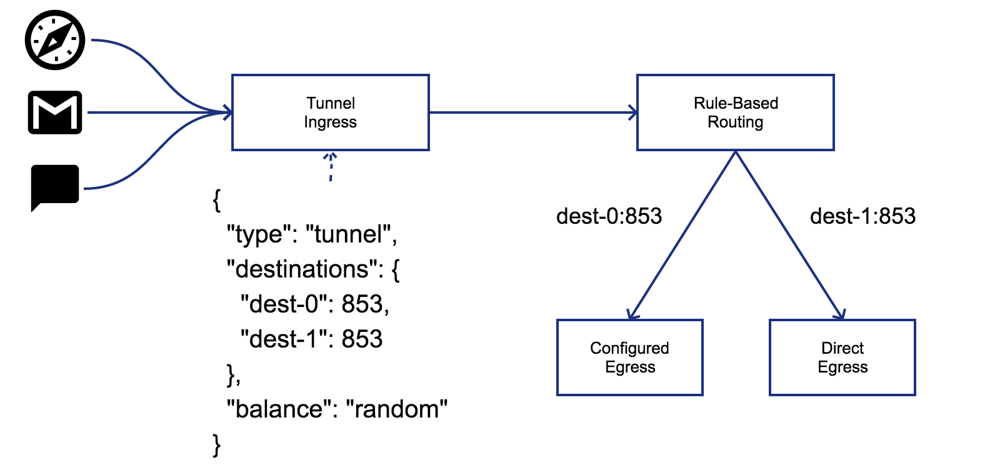
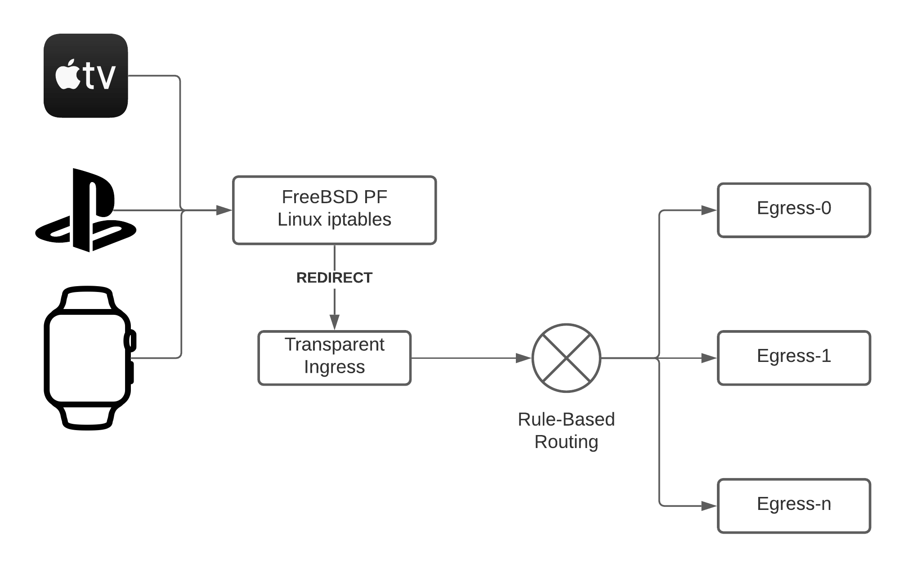

# Pichi 

Pichi is a flexible rule-based proxy.

## Build Status

### Server/Desktop

| OS | Ubuntu 22.04 | macOS 12 | Windows Server 2022 |
|:---:|:---:|:---:|:---:|
| Toolchain | GCC 12.1.0 | Xcode 14.0.1 | Visual Studio 2022 |
| Status | [](https://github.com/pichi-router/pichi/actions/workflows/linux.yml) | [](https://github.com/pichi-router/pichi/actions/workflows/macos.yml) | [](https://github.com/pichi-router/pichi/actions/workflows/windows.yml) |

### Mobile

| OS | Android | iOS |
|:---:|:---:|:---:|
| Toolchain | Android NDK 25.1 | Xcode 14.0.1 |
| Status | [](https://github.com/pichi-router/pichi/actions/workflows/android.yml) | [](https://github.com/pichi-router/pichi/actions/workflows/ios.yml) |

## Security Alert

According to [the report](https://tlsfingerprint.io/static/frolov2019.pdf), the TLS fingerprint can be used to recognize the type of TLS client for some censorship.
If you want to avoid being censored, please make sure that

- version [1.5.0](https://github.com/pichi-router/pichi/releases/tag/1.5.0) or later is used,
- AND CMake option `TLS_FINGERPRINT` was enabled while building,
- AND `sni` field is set for each TLS egress.

Pichi is trying to simulate TLS fingerprint [e47eae8f8c4887b6](https://tlsfingerprint.io/id/e47eae8f8c4887b6), which is the fingerprint of Google chrome.

## Overview

Pichi is designed

1. **to support common proxy protocols**: HTTP(S)/Socks5(s)/Shadowsocks;
1. **to dynamically and flexibly control the proxy route**: just use RESTful APIs;
1. **developer oriented**: NO GUI, but can be easily integrated into other GUIs;
1. **for personal usage**: performance is important, but not the first priority;
1. **for multiple platforms**: at least Windows, POSIX-compatible, Android and iOS.


### Motivation

Proxy is widely applied to traverse through the firewall, hide or change the original address, expose internal service port, etc. But if we iterate some famous proxy tools, it's easily recognized that each of them has at least one of these cons list below:

* Not support all of HTTP, Socks5, Shadowsocks
* Not support multiple ingresses or egresses
* No rule-based routing

As a result, the motivation of pichi is to provide a tool, which can

1. support sufficient proxy protocols,
1. be easily integrated with GUIs/APPs/scripts, which might have their own rule database,
1. control rule-based routing at runtime.

### Use cases

#### Alternative to PAC

If an individual user is using a proxy, it's very common that the network traffic is probably split into 2 pieces of flow, one going through the proxy and another going directly.
[PAC](https://en.wikipedia.org/wiki/Proxy_auto-config) is a good choice if web browsing is heavily used. But unfortunately, not all applications support PAC, such as most of [MUA](https://en.wikipedia.org/wiki/Email_client), [IM](https://en.wikipedia.org/wiki/Instant_messaging), and so on.

Pichi is an alternative choice for this situation. It separates routing rules from every application.


#### Unify proxy configuration

If the configuration for remote proxies is volatile, such as changing IP/Port periodically, it's a nightmare that lots of clients are using it.
Pichi can centralize the varies, rather than editing the configuration client by client.


#### TCP Tunnel for DNS

TCP tunnel is very useful if you want to use some DNS servers which might be already poisoned or blocked. Pichi provides *tunnel* ingress to act as a tunnel. Furthermore, the outgoing egress for each destination will be chosen by following the user-defined rules.



#### Transparent proxy

The transparent proxies are usually deployed on some internet exit router in the intranet. The difference between the transparent proxy and others is that the clients use no explicit proxy settings. It is engaging for the devices that can't use proxy settings. On the other hand, the con of the transparent proxy is that it usually requires the root privilege of the router. The proxy can also use rule-based routing to forward the requests from the transparent ingress. And it is easy to understand that the domain rules don't make any sense because the transparent ingress can't provide the domain information.



To enable the transparent proxy, it's necessary to enable the IP packet redirection on the router. When a redirected packet received, the transparent ingress can read its original destination IP address and TCP port from the firewall, if pichi has enough privilege. Pichi supports [netfilter/iptables](https://www.netfilter.org/) on Linux and [PF](https://en.wikipedia.org/wiki/PF_(firewall)) on macOS/[FreeBSD](https://docs.freebsd.org/en/books/handbook/firewalls/#firewalls-pf)/[OpenBSD](https://www.openbsd.org/faq/pf/). For instance, if pichi is running with the transparent ingress configured as below:

```
# curl -s http://pichi-router/ingresses | jq .example
{
  "type": "transparent",
  "bind": [
    {
      "host": "0.0.0.0",
      "port": 1726
    }
  ]
}
```

we can configure the firewall on Linux like:

```
# iptables -t nat -A PREROUTING -i eth0 -p tcp -j REDIRECT --to-ports 1726
```

, on macOS/FreeBSD like:

```
rdr pass on fxp0 inet proto tcp from fxp0:network to any -> 127.0.0.1 port 1726
```

, on OpenBSD like:

```
pass in on fxp0 inet proto tcp from fxp0:network to any rdr-to 127.0.0.1 port 1726
```

BTW, Here's an assumption that pichi is running on the host enabling the packet redirection with the correct privilege.

### Supported protocols

#### Ingress protocols

* Tunnel: TCP tunnel to multiple destinations to be chosen by pre-defined load balance algorithms
* Transparent: Transparent proxy for TCP
* HTTP Proxy: defined by [RFC 2068](https://www.ietf.org/rfc/rfc2068.txt)
* HTTP Tunnel: defined by [RFC 2616](https://www.ietf.org/rfc/rfc2817.txt)
* SOCKS5: defined by [RFC 1928](https://www.ietf.org/rfc/rfc1928.txt)
* Shadowsocks: defined by [shadowsocks.org](https://shadowsocks.org/en/spec/Protocol.html)
* Trojan: defined by [trojan-gfw](https://trojan-gfw.github.io/trojan/protocol) and its websocket extension defined by [trojan-go](https://github.com/p4gefau1t/trojan-go)

#### Egress protocols

* Direct: connecting to destination directly
* Reject: rejecting request immediately or after a fixed/random delay
* HTTP Proxy: defined by [RFC 2068](https://www.ietf.org/rfc/rfc2068.txt)
* HTTP Tunnel: defined by [RFC 2616](https://www.ietf.org/rfc/rfc2817.txt)
* SOCKS5: defined by [RFC 1928](https://www.ietf.org/rfc/rfc1928.txt)
* Shadowsocks: defined by [shadowsocks.org](https://shadowsocks.org/en/spec/Protocol.html)
* Trojan: defined by [trojan-gfw](https://trojan-gfw.github.io/trojan/protocol) and its websocket extension defined by [trojan-go](https://github.com/p4gefau1t/trojan-go)

**NOTE:** HTTP egress would like to try [HTTP CONNECT](https://www.ietf.org/rfc/rfc2817.txt) first. HTTP proxy will be chosen if the previous handshake is failed.

## Get started

### Installation

#### Linux

Please use [Docker](https://www.docker.com):

```
$ docker pull ghcr.io/pichi-router/pichi:latest
$ docker run --rm ghcr.io/pichi-router/pichi:latest pichi <options>
```

#### macOS

Please use [Homebrew](https://brew.sh):

```
$ brew tap pichi-router/pichi
$ brew install pichi
$ pichi <options>
```

#### FreeBSD

Please use [FreeBSD ports](https://ports.freebsd.org).

```
$ pkg install pichi
```

#### Windows or others

Please refer to **Build** section.

### Run

```
$ pichi -h
Allow options:
  -h [ --help ]              produce help message
  -l [ --listen ] arg (=::1) API server address
  -p [ --port ] arg          API server port
  -g [ --geo ] arg           GEO file
  --json arg                 Initail configration(JSON format)
  -d [ --daemon ]            daemonize
  -u [ --user ] arg          run as user
  --group arg                run as group
```

`--port` and `--geo` are mandatory. `--json` option can take a JSON file as an Initial configuration to specify ingresses/egresses/rules/route. The initial configuration format looks like:

```
{
  "ingresses": {
    "ingress-0": {/* ingress configuration */},
    "ingress-1": {/* ingress configuration */}
  },
  "egresses": {
    "egress-0": {/* egress configuration */},
    "egress-1": {/* egress configuration */}
  },
  "rules": {
    "rule-0": {/* rule configuration */},
    "rule-1": {/* rule configuration */}
  },
  "route": {/* route configuration */}
}
```

Please refer to **Using Pichi API** section for the details of configurations of ingress/egress/rule/route.

Furthermore, Pichi server reloads JSON configuration on `SIGHUP` received if OS supports.

## Using Pichi API

### Resources

* **Ingress**: defines an incoming network adapter, containing protocol type, listening address/port, and protocol-specific configurations.
* **Egress**: defines an outgoing network adapter, containing protocol type, next hop address/port, and protocol-specific configurations.
* **Rule**: contains a group of conditions, such as IP ranges, domain regular expressions, the countries of the destination IP, and so on, that the incoming connection matching ANY conditions means the one matching this rule.
* **Route**: indicates a priority ordered sequence of \[rule, egress\] pairs, and a default egress which would be forwarded to if none of the rules matched.

### API Specification

[Pichi API](https://app.swaggerhub.com/apis/pichi-router/pichi-api/1.5)

### Examples

#### Proxy like ss-local(shadowsocks-libev)

```
$ curl -i -X PUT -d '{ \
>       "type":"socks5", \
>       "bind":[ \
>         {"host":"127.0.0.1","port":1080} \
>       ] \
>     }' http://pichi-router:port/ingresses/socks5
HTTP/1.1 204 No Content

$ curl -i -X PUT -d '{ \
>       "type":"ss", \
>       "server":{"host":"my-ss-server","port":8388}, \
>       "option":{"method":"rc4-md5","password":"my-password"} \
>     }' http://pichi-router:port/egresses/shadowsocks
HTTP/1.1 204 No Content

$ curl -i -X PUT -d '{"default":"shadowsocks"}' http://pichi-router:port/route
HTTP/1.1 204 No Content

```

#### HTTP proxy except intranet

```
$ curl -i -X PUT -d '{ \
>       "type":"http", \
>       "bind":[ \
>         {"host":"::","port":8080}
>       ] \
>     }' http://pichi-router:port/ingresses/http
HTTP/1.1 204 No Content

$ curl -i -X PUT -d '{ \
>       "type":"http", \
>       "server":{"host":"http-proxy","port":8080} \
>     }' http://pichi-router:port/egresses/http
HTTP/1.1 204 No Content

$ curl -i -X PUT -d '{ \
>       "range":[ \
>         "::1/128", \
>         "127.0.0.1/32", \
>         "10.0.0.0/8", \
>         "172.16.0.0/12", \
>         "192.168.0.0/16", \
>         "fc00::/7" \
>       ], \
>       "domain":["local"], \
>       "pattern":["^localhost$"] \
>     }' http://pichi-router:port/rules/intranet
HTTP/1.1 204 No Content

$ curl -i -X PUT -d '{ \
>       "default":"http", \
>       "rules":[ \
>         ["intranet","direct"] \
>       ] \
>     }' http://pichi-router:port/route
HTTP/1.1 204 No Content

```

#### 100 shadowsocks servers

```
$ for((i=20000;i<20100;++i)); do \
>   curl -X PUT \
>   -d "{ \
>         \"type\":\"ss\", \
>         \"bind\":[ \
>           {\"host\":\"::\",\"port\":$i} \
>         ], \
>         \"option\":{ \
>           \"method\":\"rc4-md5\", \
>           \"password\":\"pw-$i\" \
>         } \
>       }" \
>   "http://pichi-router:port/ingresses/$i"; \
> done

```

#### dark web

```
$ curl -i -X PUT -d '{ \
>       "type":"socks5", \
>       "server":{"host":"localhost","port":9050} \
>     }' http://pichi-router:port/egresses/tor
HTTP/1.1 204 No Content

$ curl -i -X PUT -d '{ \
>       "type":"http", \
>       "server":{"host":"localhost","port":4444} \
>     }' http://pichi-router:port/egresses/i2p
HTTP/1.1 204 No Content

$ curl -i -X PUT -d '{"domain":["onion"]}' http://pichi-router:port/rules/onion
HTTP/1.1 204 No Content

$ curl -i -X PUT -d '{"domain":["i2p"]}' http://pichi-router:port/rules/i2p
HTTP/1.1 204 No Content

$ curl -i -X PUT -d '{ \
>       "rules":[ \
>         ["onion","tor"], \
>         ["i2p","i2p"] \
>       ] \
>     }' http://pichi-router:port/route
HTTP/1.1 204 No Content

```

#### socks5 server with TLS certificate issued by Let's encrypt CA

```
$ curl -i -X PUT -d '{ \
>       "type":"socks5", \
>       "bind":[ \
>         {"host":"::1","port":1080} \
>       ], \
>       "tls": { \
>         "key_file": "/etc/letsencrypt/live/example.com/privkey.pem", \
>         "cert_file": "/etc/letsencrypt/live/example.com/fullchain.pem" \
>       } \
>     }' http://pichi-router:port/ingresses/socks5s
HTTP/1.1 204 No Content

```

#### DNS-over-TLS proxy

```
$ curl -i -X PUT -d '{ \
>       "type":"tunnel", \
>       "bind":[ \
>         {"host":"::1","port":853} \
>       ], \
>       "option":{ \
>         "destinations": [ \
>           { "host": "2606:4700:4700::1111", "port": 853 }, \
>           { "host": "2606:4700:4700::1001", "port": 853 }, \
>           { "host": "1.1.1.1", "port": 853 }, \
>           { "host": "1.0.0.1", "port": 853 } \
>         ], \
>         "balance":"random" \
>       } \
>     }' http://pichi-router:port/ingresses/cloudflare
HTTP/1.1 204 No Content

```

#### Transparent proxy for a specific device

```
$ # Using FreeBSD PF
$ cat transparent.conf
intranet = "fxp0"
device_v6 = "the IPv6 address"
device_v4 = "the IPv4 address"
rdr pass on $intranet inet proto tcp from $device_v4 to any -> 127.0.0.1 port 1001
rdr pass on $intranet inet6 proto tcp from $device_v6 to any -> ($intranet) port 1001
$ sudo pfctl -a transparent -f transparent.conf
$
$ # Or using Linux iptables
$ sudo iptables -t nat -A PREROUTING -i eth0 -p tcp -s "${DEVICE_V4}" -j REDIRECT --to-ports 1001
$ sudo ip6tables -t nat -A PREROUTING -i eth0 -p tcp -s "${DEVICE_V6}" -j REDIRECT --to-ports 1001
$
$ # Creating the ingress
$ curl -i -X PUT -d '{ \
>       "type":"transparent" \
>       "bind":[ \
>         { \
>           "host": "::",
>           "port": 1001
>         } \
>       ] \
>     }' http://pichi-router:port/ingresses/transparent
```

#### More examples

Please refer to the [folder](schemas/examples) to find more examples.

## Build

### Requirements

* C++17
* [Boost](https://www.boost.org) 1.72.0
* [MbedTLS](https://tls.mbed.org) 2.7.0
* [libsodium](https://libsodium.org) 1.0.12
* [RapidJSON](http://rapidjson.org/) 1.1.0
* [libmaxminddb](http://maxmind.github.io/libmaxminddb/) 1.3.0
* one of the following TLS libraries
  * [OpenSSL](https://www.openssl.org) or [LibreSSL](https://www.libressl.org)
  * [BoringSSL](https://boringssl.googlesource.com/boringssl/) if `TLS_FINGERPRINT` enabled

### CMake options

* `BUILD_SERVER`: Build pichi application, the default is **ON**.
* `BUILD_TEST`: Build unit test cases, the default is **ON**.
* `STATIC_LINK`: Generate static library, the default is **ON**.
* `INSTALL_DEVEL`: Install development files, the default is **OFF**.
* `TRANSPARENT_PF`: Build the transparent ingress implemented by PF, the default is **OFF**.
* `TRANSPARENT_IPTABLES`: Build the transparent ingress implemented by iptables, the default is **OFF**.
* `TLS_FINGERPRINT`: Enable TLS fingerprint simulation, which requiring [BoringSSL](https://boringssl.googlesource.com/boringssl/), the default is **ON**.

### Build and run tests with CMake

```
$ cmake -B /path/to/build /path/to/pichi
$ cmake --build /path/to/build
$ cmake --build /path/to/build --target test
```

### Build with Conan

[Conan](https://conan.io) is a powerful package manager for C/C++. It's very fit for handling C/C++ dependencies and cross compilation. `.conan` directory contains:

* `.conan/profiles`: the profiles for the specific platforms
* `.conan/recipes`: the customized conan recipes
* `.conan/scripts`: the convenient scripts to build Pichi

#### Exporting recipes

```
$ export PICHI_VERSION=1.5.0
$ bash .conan/scripts/export.sh -d new "${PICHI_VERSION}"
```

#### Building

```
$ # Desktop/Server
$ # Windows
$ sh .conan/scripts/build.sh -p windows "${PICHI_VERSION}"
$
$ # Macos
$ sh .conan/scripts/build.sh -p macos "${PICHI_VERSION}"
$
$ # Linux
$ sh .conan/scripts/build.sh -p linux "${PICHI_VERSION}"
$
$ # FreeBSD
$ sh .conan/scripts/build.sh -p freebsd "${PICHI_VERSION}"
$
$ # Mobile
$ # iOS
$ sh .conan/scripts/build.sh -a armv8.3 -v 16.0 -p ios "${PICHI_VERSION}"
$
$ # Android
$ sh .conan/scripts/build.sh -a armv8 -l 33 -r android-ndk/r25@ -p android "${PICHI_VERSION}"
```

### Docker

The pre-built docker image can be found on [GitHub Package](https://github.com/pichi-router/pichi/pkgs/container/pichi),
which is automatically generated according to `docker/pichi.dockerfile`.
Furthermore, `docker/builder.dockerfile` is intended to provide a docker environment
for development.

```
$ docker pull ghcr.io/pichi-router/pichi
$ docker run -d --name pichi --net host --restart always ghcr.io/pichi-router/pichi \
>   pichi -g /usr/share/pichi/geo.mmdb -p 1024 -l 127.0.0.1
c51b832bd29dd0333b0d32b0b0563ddc72821f7301c36c7635ae47d00a3bb902
$ docker ps -n 1
CONTAINER ID        IMAGE                              COMMAND                  CREATED             STATUS              PORTS               NAMES
c51b832bd29d        ghcr.io/pichi-router/pichi         "pichi -g /usr/share…"   1 seconds ago       Up 1 seconds                            pichi
```

## Integration with pichi

There are 2 ways to integrate with pichi:

* **Standalone**: pichi runs in its own process,
* **In-Process**: pichi runs in its supervisor process.

Regardless of any mode, the supervisor must communicate with pichi via RESTful APIs.

### Standalone

Standalone mode requires `BUILD_SERVER` CMake option, which builds code in `server` directory. For example:

```
$ cmake -D CMAKE_INSTALL_PREFIX=/usr -D CMAKE_BUILD_TYPE=MinSizeRel -D BUILD_SERVER=ON -B build .
$ cmake --build build --target install/strip
```

### In-Process

In-Process mode is suitable for the scenarios that the standalone process is prohibited or unnecessary, such as iOS/Android, or the supervisor prefers to run pichi in its own process. There are 2 types of interface to run pichi.

#### C function

C function can be invoked by lots of program languages. It's defined in `include/pichi.h`:

```C
/*
 * Start PICHI server according to
 *   - bind: server listening address, NOT NULL,
 *   - port: server listening port,
 *   - mmdb: IP GEO database, MMDB format, NOT NULL.
 * The function doesn't return if no error occurs, otherwise -1.
 */
extern int pichi_run_server(char const* bind, uint16_t port, char const* mmdb);
```

`pichi_run_server` will block the caller thread if no error occurs.

#### C++ class

C++ class might sometimes be friendly while the supervisor is written in C++. It's defined in `include/pichi/api/server.hpp`:

```C++
class Server {
public:
  Server(boost::asio::io_context&, char const* mmdb);
  void listen(std::string_view bind, uint16_t port);
};
```

`pichi::api::Server` accepts a `boost::asio::io_context` object reference, which is shared by the supervisor. Furthermore, `Server::listen` **doesn't** block the caller thread. It means that the supervisor can invoke `io_context::run()` right where it wants to do. Here's a simple code snippet:

```C++
#include <pichi/api/server.hpp>

auto io = boost::asio::io_context{};

auto server = pichi::api::Server{io, mmdb};
server.listen(bind, port);

// Setup other ASIO services

io.run();  // Thread blocked

```

## Donation

Please offer me a cup of coffee if you like pichi.

[](
https://www.blockchain.com/btc/payment_request?address=33CEcNHjKpyHSq4gfVHDhkDjYwWjLQt3Qo
)
