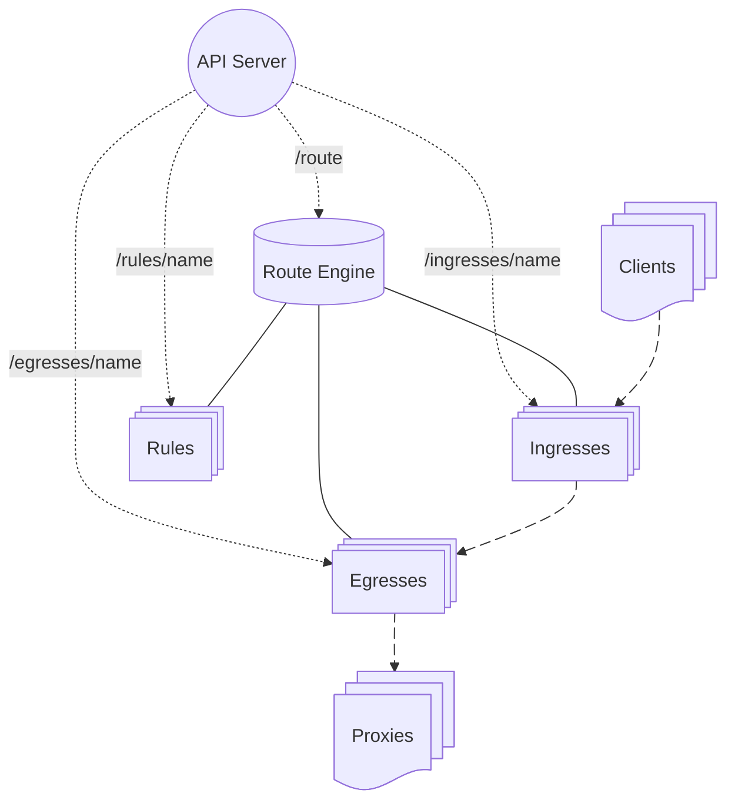
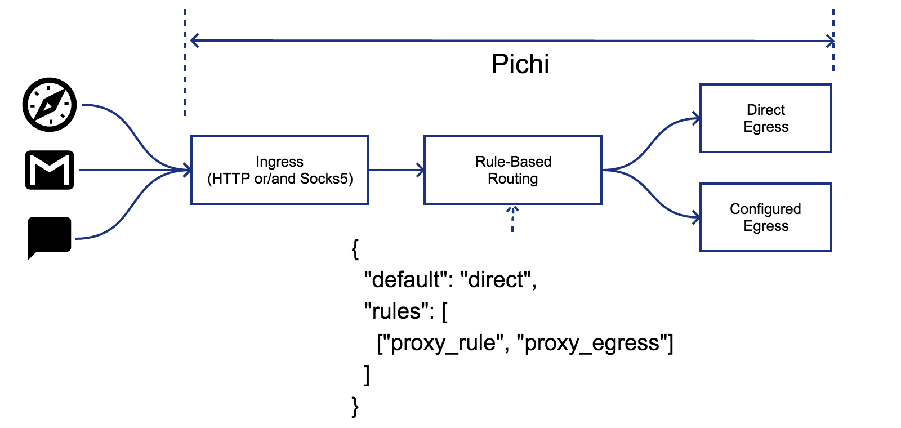
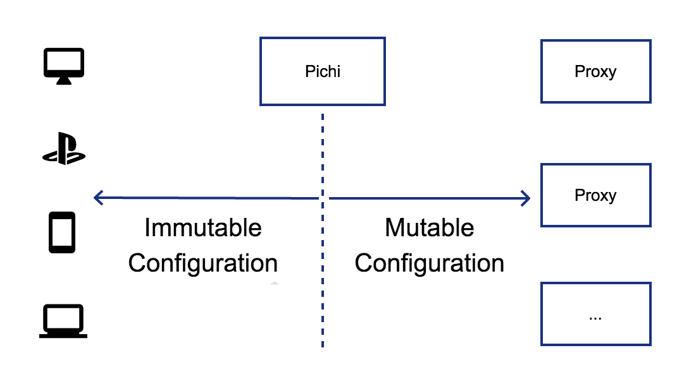
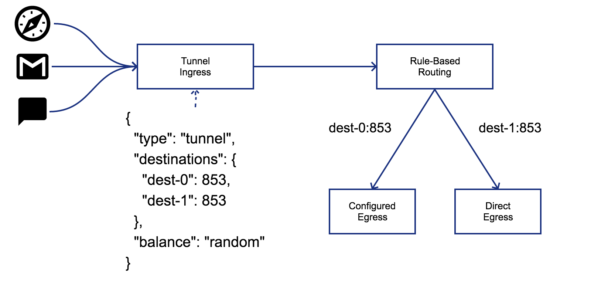
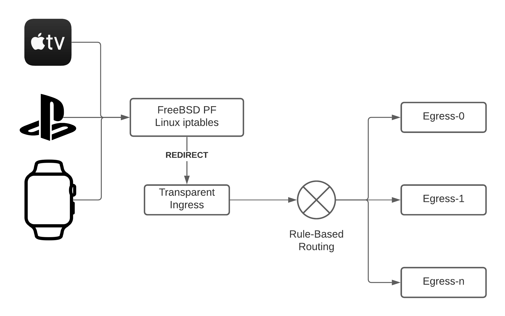

# Overview

Pichi is designed with the following core principles:

1. **Protocol Support**: Handles common [proxy protocols](./#supported-protocols) like HTTP(S), Socks5(s), etc.
1. **Flexible Routing**: Features a dynamic routing engine controlled entirely via [RESTful APIs](./api-specification).
1. **Developer-Oriented**: Dispenses with a built-in GUI in favor of seamless [integration](./integration) into 3rd-party interfaces.
1. **Personal Scale**: Prioritizes features and usability for personal environments over absolute, enterprise-grade performance optimization.
1. **Cross-Platform**: Runs natively acrosss Windows, POSIX-compliant systems, Android and iOS.

# Anatomy



# Motivation

Proxies are widely used to bypass firewalls, mask or alter source IP addresses, and expose internal services.
However, most popular proxy tools suffer from at least one the following limitations:

- **Incomplete Protocol Support**: They fail to support HTTP, Socks5, Shadowsocks simulaneously.
- **Rigid Topologies**: They lac support for multiple concurrent ingresses or egresses.
- **Static Configurations**: They do not offer flexible, rule-based routing.

Pichi was created to bridge these gaps by providing a unified tool designed to:

1. Support a comprehensive suite of proxy protocols out of the box.
1. Integrate seamlessly with third-party GUIs, applications, and scripts that manage their own rule databases.
1. Enable dynamic, rule-based routing control at runtime.

# Use cases

## Alternative to PAC

When using a proxy, individual users often need to split their network traffic—routing some data through the proxy while letting other traffic connect directly.
[Proxy Auto-Config (PAC)](https://en.wikipedia.org/wiki/Proxy_auto-config) files are a common solution for web browsers, 
but unfortunately, many standalone applications (such as mail clients, instant messengers, and CLI tools) do not support PAC.

Pichi solves this problem by handling routing at the system level.
By separating routing rules from individual applications, Pichi ensures consistent traffic splitting across your entire environment, regardless of app-specific proxy support.



## Unify proxy configuration

Managing remote proxy configurations can become incredibly tedious if upstream server details—such as IPs, ports, or credentials—change frequently.
Manually updating these parameters across dozens of different client applications is inefficient and error-prone.

Pichi acts as a centralized gateway that abstracts these changes away. Instead of updating every individual client application, you only modify the configuration within Pichi.
Your local clients continue pointing to FOO's static endpoint without experiencing any disruption.



## TCP Tunneling for DNS

Tunneling DNS traffic over TCP is highly effective for bypassing DNS poisoning, tampering, or network blocks.

Pichi provides a dedicated tunnel ingress to securely encapsulate this traffic.
Furthermore, instead of routing all tunneled requests blindly, Pichi evaluates the destination of each query against your user-defined rules to select the optimal outbound egress.



## Transparent proxy

Transparent proxies are typically deployed on a gateway router at the edge of an intranet.
Unlike standard proxies, a transparent proxy requires zero configuration on individual client machines,
making it ideal for IoT devices or hardware that does not support explicit proxy settings.

### Trade-offs & Technical Considerations

- **Privilege Requirements**: Implementing a transparent proxy usually requires root privileges on the router to handle low-level traffic interception.
- **Routing Restrictions**: While Pichi can apply rule-based routing to traffic arriving via a transparent ingress, domain-based rules will not function. Because interception happens at the IP layer, the transparent ingress only has access to destination IP addresses, not domain names.



### How it works

To enable this feature, you must configure IP packet redirection (port forwarding) via your router's firewall.
Upon receiving a redirected packet, Pichi queries the kernel firewall subsystem to determine the packet's original destination IP address and TCP port.
Pichi natively supports this mechanism via [netfilter/iptables](https://www.netfilter.org/) on Linux and [PF](https://home.nuug.no/~peter/pf/en/) on macOS, BSDs.
For example, if Pichi is running with the transparent ingress configuration shown below:

```
# curl -s http://pichi-router/ingresses | jq .example
{
  "type": "transparent",
  "bind": [
    {
      "host": "127.0.0.1",
      "port": 1001
    }
  ]
}
```

you can configure the Linux firewall using the following rules:

```
# iptables -t nat -A PREROUTING -i eth0 -p tcp -j REDIRECT --to-ports 1001
```

, macOS/FreeBSD 14.0:

```
rdr pass on fxp0 inet proto tcp from fxp0:network to any -> 127.0.0.1 port 1001
```

, OpenBSD/FreeBSD 15.0:

```
pass in on fxp0 inet proto tcp from fxp0:network to any rdr-to 127.0.0.1 port 1001
```

{: .note }
> This example assumes Pichi is running with root privileges on the host machine where packet redirection is enabled."
